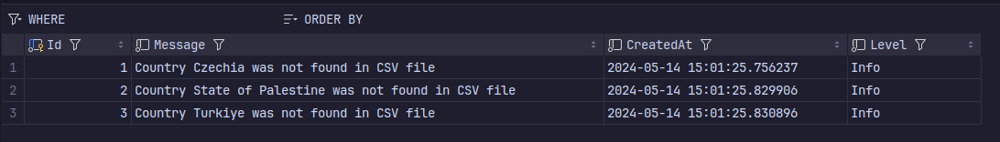

# Übung: DAO

Sophie Haider, Lorenz Holzbauer, Luna Klatzer

## 1) Beschreibung der Datensätze
- Countries_1960-2023.csv: in dieser CSV werden die totale Population, die Prozentzahl der Landbevölkerung, Geburtsrate für 1960 bis 2023 gespeichert

- WorldHappinessIndex-Files:

    |CSV|JSON|Beschreibung|
    |--|--|--|
    |Country name|Country name| Name des Landes
    |year| \- | Jahr der Datenaufnahme, das Jahr ist 2023
    |Life Ladder|Ladder score|HappinessIndex|
    |Log GDP per capita|Logged GDP per capita|Brutto Inland Produkt pro Kopf| 
    |Social support|Social support| Soziale Unterstützung|
    |Healthy life expectancy at birth|Healthy life expectancy|Lebenserwartung|
    |Freedom to make life choices|Freedom to make life choices|Freiheit um Lebensentscheidungen zu machen|
    |Generosity|Generosity|Großzügigkeit|
    |Perceptions of corruption|Perceptions of corruption|Wahrnehmung von Korruption|
    |\-|Standard error of ladder score|Standardabweichung des HappinessIndexes|
    |\-|upperwhisker| oberer Whisker (Box-Plot) |
    |\-|lowerwhisker| unterer Whisker (Box-Plot)|
    |\-|Ladder score in Dystopia| HappinessIndex in Relation zur Dystopie |
    |\-|Explained by: Log GDP per capita| Grund: BIP pro Kopf|
    |\-|Explained by: Social support| Grund: soziale Unterstützung|
    |\-|Explained by: Healthy life expectancy|Grund: Lebenserwartung|
    |\-|Explained by: Freedom to make life choices|Grund: Freiheit um Lebensentscheidungen zu machen|
    |\-|Explained by: Generosity|Grund: Großzügigkeit|
    |\-|Explained by: Perceptions of corruption| Grund: Wahrnehmung von Korruption|
    |\-|Dystopia + residual| Dystopia und statistische Unbekanntheit|


## 2) Datenmodell und Technologien

**Technologien:**

- Backend: .NET, EntityFramework
- Datenbank: MySQL in Docker

**Datenmodell:**

Unser CSV und unser JSON Dao implementieren das Interface IHappinessIndexDao. Dieses Interface definiert, dass jeder Dao eine Funktion für das Importen benötigt. Im Import werden die Fileinhalte auf die gewünschte Struktur geparsed und in die Datenbank eingefügt:

ICountry:

``` csharp
public interface ICountry : IBaseEntity
{
    public string Name { get; set; }

    public string? CountryCode { get; set; }

    public List<Year>? Years { get; set; }
}
```

IYear:

``` csharp
public interface IYear : IBaseEntity
{
    public int YearNumber { get; set; }
    public double? BirthRate { get; set; }
    public long? PopulationTotal { get; set; }
    public double? RuralPopulation { get; set; }
    public int? HappinessIndexId { get; set; }
    public HappinessIndex? HappinessIndex { get; set; }
}
```

IHappinessIndex:

``` csharp
public interface IHappinessIndex : IBaseEntity
{
    public double? LifeLadder { get; set; }
    public double? LifeLadderStandardError { get; set; }
    public double? UpperWhisker { get; set; }
    public double? LowerWhisker { get; set; }
    public double? LogGdpPerCapita { get; set; }
    public double? SocialSupport { get; set; }
    public double? HealthyLifeExpectancyAtBirth { get; set; }
    public double? FreedomToMakeLifeChoices { get; set; }
    public double? Generosity { get; set; }
    public double? PerceptionOfCorruption { get; set; }
    public double? PositiveAffect { get; set; }
    public double? NegativeAffect { get; set; }
    public double? LifeLadderInDystopia { get; set; }
    public double? DystopiaPlusResidual { get; set; }
}
```

Die Klassen implementieren diese Interfaces. Wird ein HappinessIndex eingefügt, dessen Country in der Datenbank noch nicht existiert, wird dieses erstellt und das Event in die Log-Tabelle eingefügt.

Die Daos implementieren alle die Funktionen vom Interface IHappinessIndexDao:

``` csharp
public interface IHappinessIndexDao
{
    public Task<List<Country>> ImportAllCountriesAsync();
}
```

## 3) Log-Entries



## 4) Query A

Welches Land hatte den größten Abfall im WHI? (Vergleich frühester Eintrag zu spätestem Eintrag) Welche anderen Werte sind in diesem Land ebenfalls abgefallen oder gestiegen? Erkennen Sie 
einen Zusammenhang?

Die Query durchsucht jedes Land und vergleicht den ersten und letzten Eintrag des HappinessIndex. Das Land mit dem größten Abfall wird zurückgegeben.

```csharp
static Country GetCountryWithMaxHappinessIndexDrop(List<Country> countries)
{
    Country? countryWithMaxDrop = null;
    double maxDrop = double.MinValue;

    foreach (var country in countries)
    {
        var years = country.Years!.OrderBy(y => y.YearNumber).ToList();

        var initialHappiness = years.First().HappinessIndex?.LifeLadder ?? 0;
        var latestHappiness = years.Last().HappinessIndex?.LifeLadder ?? 0;

        if (initialHappiness - latestHappiness > maxDrop)
        {
            maxDrop = initialHappiness - latestHappiness;
            countryWithMaxDrop = country;
        }
    }
    return countryWithMaxDrop!;
}
```

In unserem Fall war das Ergebnis der Kongo, was plausibel klingt da es sich um ein Land handelt, das in den letzten Jahren durch politische Unruhen und Armut geprägt war.